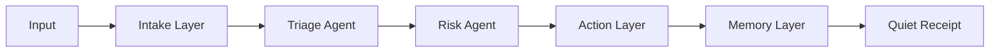

# MindReply Architecture

## Intent

MindReply is a quiet decision layer for modern work. It does not add more screens. It reduces the space between pressure and movement.

## Runtime Shape

## Source Boundaries

- `app/`: public homepage, privacy page, intake endpoint, health endpoint.
- `components/DecisionIntake.tsx`: minimal inline intake surface.
- `lib/decision-layer.ts`: live TypeScript decision contract.
- `src/backend/`: deterministic backend engines and tests.
- `src/integrations/`: Gmail/IMAP and calendar connectors.
- `src/edge/extension/`: browser extension surface.
- `src/agents/prompts.md`: four-agent prompt contract.

## Output Contract

Every decision returns:

- one synthesis
- one recommended action
- one risk status
- one memory update
- one receipt
